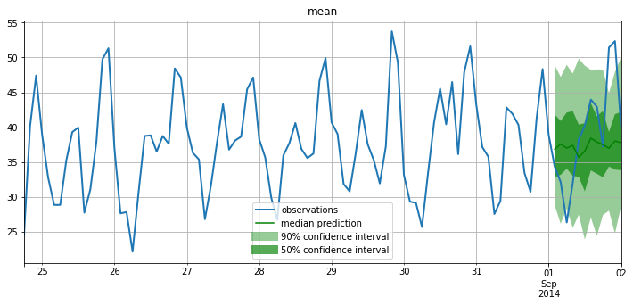
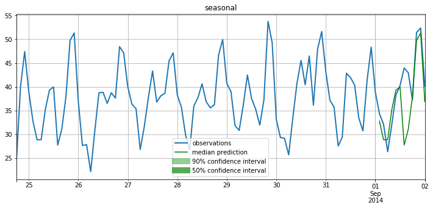
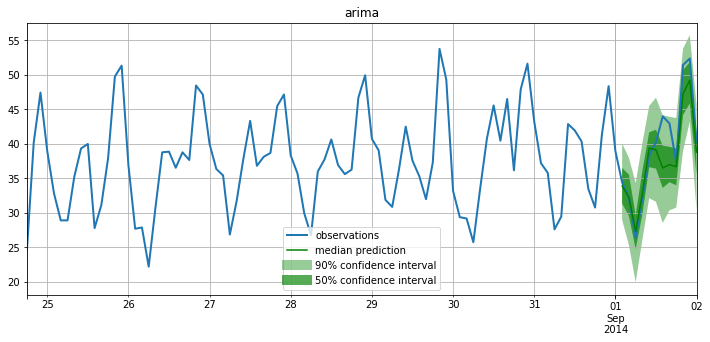
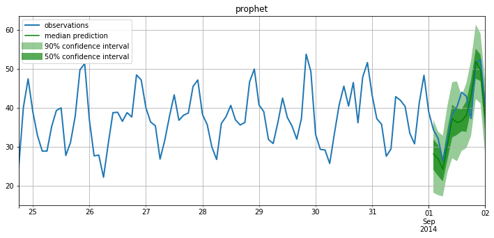
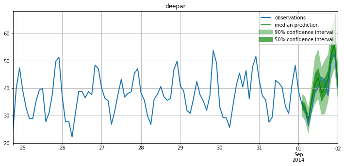

## amazon-sagemaker-forecast-algorithms-benchmark-using-gluonts

Sample Code for use of the Gluonts Python library in AWS Sagemaker Notebook Instance to benchmark popular time series forecast Algorithms, including 
* [ARIMA](https://en.wikipedia.org/wiki/Autoregressive_integrated_moving_average)
* [Prophet](https://facebook.github.io/prophet/docs/quick_start.html)
* [DeepAR](https://gluon-ts.mxnet.io/api/gluonts/gluonts.model.deepar.html)

amazon-sagemaker-forecast-algorithms-benchmark-using-gluonts.ipynb gives an example on how to compare forecast algorithms on a dataset by only using the Gluonts library.
* The Jupyter notebook should be run in a AWS Sagemker Notebook Instance (ml.m5.4xlarge is recommended)
* Pls use the conda_python3 kernel.

The example charts below visualize the comparison of different algorithms on prediction the same time series.

## License

This library is licensed under the MIT-0 License. See the LICENSE file.

